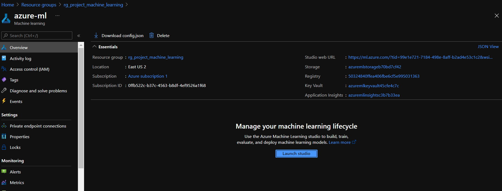
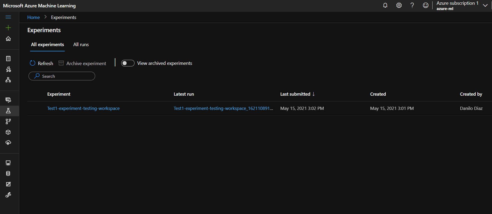
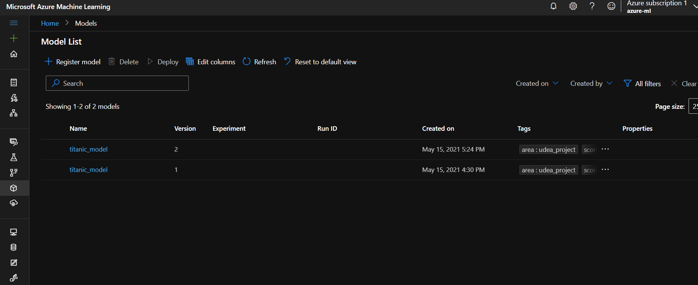
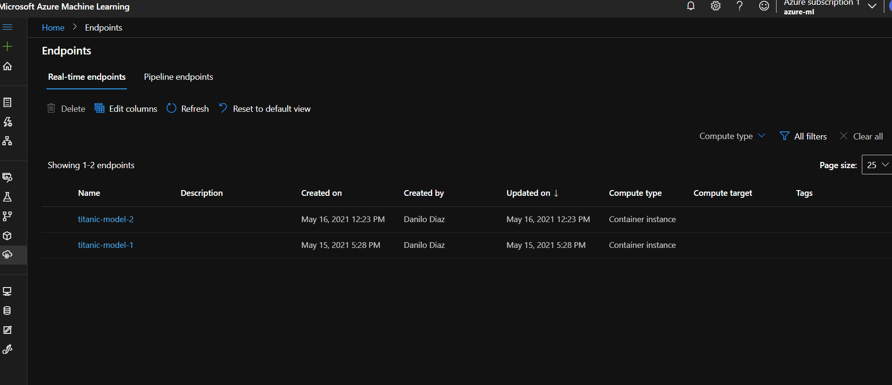
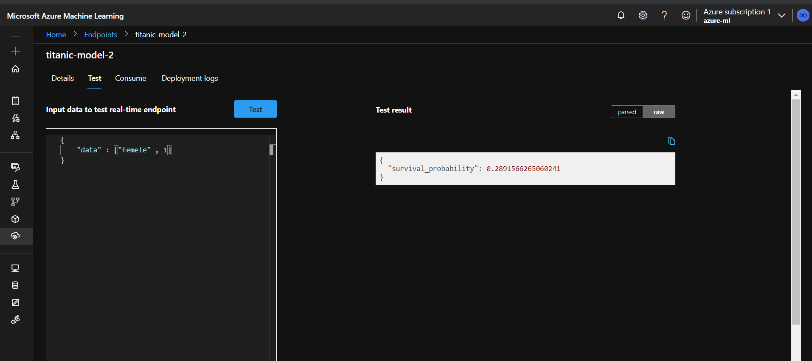
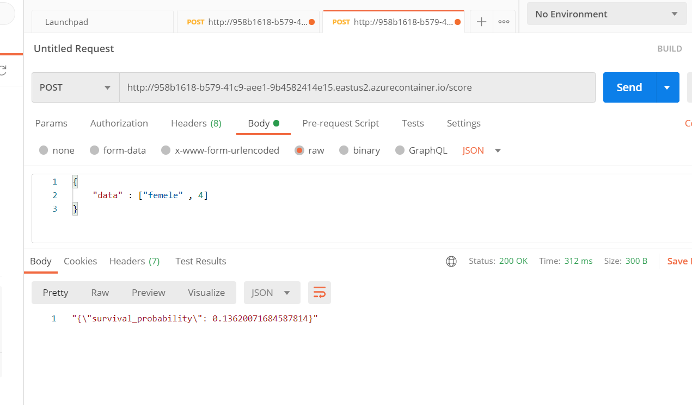

## Cloud - Especialización en analítica y ciencia de datos.

## Presentado por:

- Danilo Diaz Valencia : danilo.diaz@udea.edu.co

- Santiago Jaramillo: santiago.jaramillog1@udea.edu.co


### Titanic survival_probability PREDICTION

El ejercicio actual consiste en la predicción de supervivencia de pasajero en la catástrofe del Titanic. El objetivo de este proyecto es de desplegar un servicio web en la nube publica de Azure mediante AzureML. Este servicio es capaz de predecir la probabilidad de supervivencia del pasajero según el género y la clase en la que estaba viajando.[link](https://www.kaggle.com/c/titanic/data)

## Descripción de los datos
[Titanic Dataset](https://www.kaggle.com/c/titanic/data)


- passenger_id : Id Pasajero
- pclass : Ticket class : 1 = 1st, 2 = 2nd, 3 = 3rd
- name : Nombre pasajero
- sex : Sexo pasajero
- age = Edad pasajero
- sibsp = Hermano a bordo
- parch: Parientes a bordo
- ticket : # de ticket
- fare : Tarifa pasajero
- cabin :  # de Cabina
- embarked : Puerto de embarcación : C = Cherbourg, Q = Queenstown, S = Southampton
- survival : Sobrevivió 0 = No, 1 = Yes

## Requerimientos

- Subscripción de Azure.
- Docker, solo para ambiente local, recomendado para procesos de debug.
- Crear ambiente
- Python 3.8 -
- IDE vs code o equivalente.

## ¿Cómo ejecutarlo?

- Crear un nuevo ambiente 
- Instalar las siguientes dependencias

```bash
pip install -r requirements.txt
```
```bash
pip install azureml-core
pip install azureml
pip install azureml-contrib-services
pip install numpy
pip install pandas
pip install scikit-learn
pip install scikit-multilearn
```


- Ejecutar el primer script de creación del ambiente 

```bash
python ./01-create-environment.py
```

- Seguir los pasos de autenticación interactiva y esperar a que el script nos aprovisione con un entorno de machine learning. Al finalizar dentro de una carpeta llamada .azureml debe existir un archivo configuración con los parámetros del equipo.

- La configuración despues del primer script debe generar los siguientes recursos dentro del grupo: Azure Machine Learning, Container registry, Application Insights, Key Vault, Storage Account.

NOTA: Si se quiere es posible usar azure cli!



- Ejecutar el segundo script para aprovisionar el entorno de Machine Learning con un cluster para gestionar la computación. Una vez finalice el script debe aparecer en la pestaña de computo del panel general de machine learning un nuevo cluster con el nombre: cpu-cluster

```bash
python ./02-create-compute.py
```


- Ejecutar el tercer script para verificar ambiente de trabajo

```bash
python ./03-test-workspace-remote.py
```




- Ejecute el cuarto script para registrar el modelo en Azure

```bash
python ./04-azure-model-registration.py
```




- Ejecute el quinto script para desplegar el modelo

```bash
python ./05-deploy-azure-model-aci.py
```




# Servicio Azure Test

La Api es con fines educativos por tal motivo solo esta disponible por un tiempo determinado!!!

- Link Api [Api-Titanic](http://958b1618-b579-41c9-aee1-9b4582414e15.eastus2.azurecontainer.io/score)

```yaml
{
    "data" : ["mele" , 4]
}

```



## Postman Test

http://958b1618-b579-41c9-aee1-9b4582414e15.eastus2.azurecontainer.io/score




